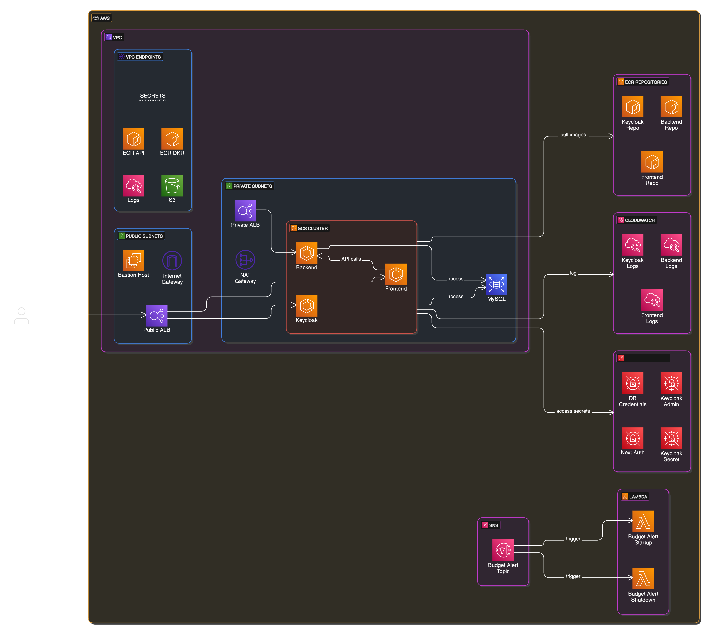

### Prerequisites: 
- Install [Terraform](https://developer.hashicorp.com/terraform/downloads)
- Install [AWS CLI](https://docs.aws.amazon.com/cli/latest/userguide/getting-started-install.html)
- Run `aws configure` to set up AWS credentials and default region.
- Setup a `terraform.tfvars` file or environment variables for credentials and secrets. An example file can be found in `deployment/terraform/terraform.tfvars.example`.
- **Run terraform_setup project:** [README](../../../terraform_setup/README.md)
- **Run terraform shared project:** [README](../../../terraform/shared/README.md)

## Terraform Deployment

This directory contains Terraform configurations for deploying and managing infrastructure resources for PPP on AWS. 
The infrastructure is managed via GitHub Workflows and can also be run locally without inconsistencies, as the `.tfstate` file is stored in an S3 bucket.
To run Terraform locally, a `.tfvar` file with all necessary variables must be created, including AWS access credentials.

## Table of Contents
- [Docs](#docs)
- [Architecture Overview](#architecture-overview)
- [Directory Structure](#directory-structure)
- [Environment Variables](#environment-variables)
- [Terraform Commands](#terraform-commands)
- [GitHub Actions](#github-actions)
- [Database Connection](#database-connection)
- [Lambda](#lambda)
- [Cost-Guard / Kill-Switch](#cost-guard--kill-switch)
- [Notes: Terraform destroy](#notes-terraform-destroy)


## Docs
- [Terraform](https://developer.hashicorp.com/terraform/docs)
- [Terraform AWS Provider](https://registry.terraform.io/providers/hashicorp/aws/latest/docs)
- [AWS Documentation](https://docs.aws.amazon.com/)


## Architecture Overview
https://app.eraser.io/workspace/DRsDnyYzDCVcvWMbk8iI?origin=share



## Directory Structure
```
terraform/
├── main.tf                          # Main configuration file for all environments
├── variables.tf                     # Shared variable definitions
├── envs/                          # Environment-specific configurations
│   ├── dev.tfvars                   # Variables for the Dev environment
│   ├── dev-state.config             # Backend config for the Dev environment
│   ├── prod.tfvars                  # Variables for the Prod environment
│   └── prod-state.config            # Backend config for the Prod environment
modules/                         # Reusable modules
 └── rds/                         # RDS module
     ├── main.tf                  # Resource definitions
     ├── outputs.tf               # Output variables
     └── variables.tf             # Input variables
```

## Environment Variables

Terraform requires certain variables to define the infrastructure. An example `.tfvar` file can be found in `deployment/terraform/terraform.tfvars.example`. 
Terraform also allows variables to be defined via environment variables. These variables should have the prefix `TF_VAR_`. 
Case sensitivity must be observed.

- `TF_VAR_aws_access_key`
- `TF_VAR_aws_secret_key`
- ....

For the use of different environments, .tfvar files can also be created per environment. 
These must be specified when executing a Terraform command.
Additionally, the backend config differs, in the path to the state file, between environments.
Therefore, the path needs to be specified on the init command, because it cannot be done with a variable.

Example:<br>
`terraform init -backend-config="key=dev/state/terraform.tfstate"` <br>
`terraform plan -var-file="config/dev.tfvars"` <br>
`terraform apply -var-file="config/dev.tfvars"`

**Priority of Inputs:**

Variables are loaded in following order.
If varibales are defined multiple times, the last loaded variable is used.

```
- Environment variables
- The terraform.tfvars file, if present.
- The terraform.tfvars.json file, if present.
- Any *.auto.tfvars or *.auto.tfvars.json files, processed in lexical order of their filenames.
- Any -var and -var-file options on the command line, in the order they are provided. (This includes variables set by an HCP Terraform workspace.)
```

## Terraform-Commands

**DEV-Environment**
- `terraform init -backend-config="envs/dev-state.config" -reconfigure`
- `terraform plan -var-file="envs/dev.tfvars"`
- `terraform apply -var-file="envs/dev.tfvars"`

**PROD-Environment**
- `terraform init -backend-config="envs/prod-state.config" -reconfigure`
- `terraform plan -var-file="envs/prod.tfvars"`
- `terraform apply -var-file="envs/prod.tfvars"`


**Init the Terraform Project:**
```sh
terraform init
```

**check the formatting of all Terraform config files:**
```sh
terraform fmt -check
```

**Automatically format all Terraform config files:**
```sh
terraform fmt -write=true
```

**Validate the Terraform config:**
```sh
terraform validate
```

**Show all changes between the current infrastructure and the Terraform configuration:**
```sh
terraform plan
```

**Apply config changes to the infrastructure:**
```sh
terraform apply -auto-approve
```

## GitHub Actions

To manage the infrastructure Terraform gets executed in GitHub Workflows.
Following workflows are defined:

- `.github/workflows/terraform-push.yml`: Validates the Terraform-Code after pushing it to Github
- `.github/workflows/terraform-pr.yml`: Runs `terraform plan` during Pull Requests and comments the changes
- `.github/workflows/terraform-merge.yml`: Applies the changes during a merge to main. (Currently only on manual dispatch) 


## Database Connection
The Database is only available inside the VPC. To connect to the database from your local machine, 
it's needed to create an SSH tunnel to the VPC.

This can be done by connecting to a bastion host.
The bastion host is a small EC2 Instance running inside the VPC, which can be used to build a SSH Tunnel to access the database from outside the VPC.

To create a secure SSH Tunnel, and so that we don't have to handle SSH Keys, the AWS Session Manager is used to connect to the bastion host and start a port forwarding session.

**Prerequisite:**

- AWS account (Access Key and Secret Key)
- Install AWS CLI: https://docs.aws.amazon.com/cli/latest/userguide/getting-started-install.html
- Install Session Manager Plugin: https://docs.aws.amazon.com/systems-manager/latest/userguide/session-manager-working-with-install-plugin.html

**Login to AWS CLI:**
- Run `aws configure`
- User your personal Access Key and Secret Key, and region `eu-north-1`

**Start Port Forwarding Sessions:**

To start a port forwarding session, the Instance ID of the bastion host and the address of the database is needed.
You can get both using the AWS CLI in the following way:

- INSTANCE-ID:
  - Run `aws ec2 describe-instances --filters Name=tag:Environment,Values=dev --query 'Reservations[*].Instances[*].InstanceId'`
    - Filter for `values=dev` can also be used for prod environment like `values=prod`
- DB-ADDRESS:
  - Run ``aws rds describe-db-instances --query 'DBInstances[?contains(TagList[].Key, `Environment`) && contains(TagList[].Value, `dev`)].Endpoint.Address'``
  - Filter for `dev` can also be used for prod environment like `prod`

Example values:
- INSTANCE-ID: "i-0a1b2c3d4e5f6g7h8"
- ADDRESS: "ppp-dev-database.crs2gciekfg6.eu-north-1.rds.amazonaws.com"

**Finally start port forwarding:**
```sh
aws ssm start-session --target <INSTANCE ID> --document-name AWS-StartPortForwardingSessionToRemoteHost --parameters host="<DB-ADDRESS>",portNumber="3306",localPortNumber="3307"
```

If the proxy is running, the database can be accessed on `127.0.0.1:3307`.

The benefit of using the AWS Session Manager vs direct ssh connections with keys is, that we don't have to handle SSH Keys and therefore don't have to worry about the security of the keys.
The Session Manager also has the possibility to log all the commands that are executed on the bastion host, which can be useful for debugging and auditing.

### How to give user access to the database

- Create a User in the AWS Console
  - IAM > Users > Create User
    - User does not need access to the AWS Console
  - Attach policies directly
    - Add `AllowSSMaccess` - Policy. 
    - If it does not exist, create the policy and add following JSON:
    ```json
    {
        "Version": "2012-10-17",
        "Statement": [
            {
                "Effect": "Allow",
                "Action": [
                    "ssm:DescribeInstanceInformation",
                    "ssm:StartSession",
                    "ssm:SendCommand",
                    "ssm:DescribeDocument",
                    "ssm:ListCommands",
                    "ec2:DescribeInstances",
                    "rds:DescribeDBInstances"
                ],
                "Resource": "*"
            }
        ]
    }
    ```
  - Create credentials for the newly created user
    - IAM > Users > New User > Security Credentials > Create Access Key
      - Create an Access Key for Application running outside AWS
  - Provide the user with his credentials
    - Access Key ID
    - Secret Access Key

### Initial database installation 

After setting up the database in the cloud, the required database ppp_app and the initial users backend_app and spdb_admin, which are mandatory for the execution and installation of updates, are missing. The following command must be used to set these up:

```sh
mvn initialize '-P run_root_scripts,installOnProd' '-Dspring.datasource.username=admin'  '-Dspring.datasource.password=[pwd_admin]' '-Dbackendapppd=[pwd_backend_app]' '-Ddbadminpassword=[pwd_spdb_admin]' liquibase:update
```

Before installation, the setup file must be adjusted regarding the database path `.\backend\src\main\resources\application-prod.yml`

The installation must done by a root or comparable user.
Replace the following text in the installation command above:

[pwd_admin]         => Root user 'admin' password
[pwd_backend_app]  => User password of backend_app
[pwd_spdb_admin]   => User password of the ppp database administrator spdb_admin

### Bastion Host: Nice to Know

To connect interactively to the Bastion host without establishing port forwarding:
```sh
aws ssm start-session --target <INSTANCE ID>
```

To connect from Bastion Host to the DB:
```sh
  mysql --user=<DB-USER> --password=<USER_PASSWORD> --host=<DB-URL>
```

## Lambda
Lambda functions get provided to AWS as .zip files. 
The .zip files contain the source code for the lambda functions.

Dependencies are handle by AWS Lambda Layers.
Lambda Functions are used 
- for our "Kill-Switch" functionality, which is used to stop the ECS instances in case of an exploding costs.
- to start and stop dev ECS instances at night
- to run backup validation tests

## Cost-Guard / Kill-Switch
The variable `cost_limit` is used to define the max amount of cost per month. 
If certain thresholds, based on the cost_limit, are hit, notifications get send / the ECS Pods get stopped.

**Thresholds:**
- 90% of the cost_limit: Notification Mail
- 100% of the cost_limit: Notification Mail
- 120% of the cost_limit: Notification Mail + Stop ECS Pods (set autoscaling to min/max 0)

To restart the ECS Pods, just re-execute the Terraform apply command (this will set autoscaling min/max to 1) or simply run the ppp-lambda-startup function.
One easy way to do this is to use the AWS Console and execute the Lambda function manually.

Go to `Lambda -> Functions -> ppp-lambda-startup -> Test -> Test`

## How-To: New Dev Deployment
Basically the deployment can be triggered with `terraform apply <your config>`.
But the deployment currently needs a few manual steps, to be executed on the db, to work properly. See [Database Connection](#database-connection) for details about connecting to the DB.
1. For the current dev environment setting, Liquibase expects the DB User `backend_app` to be present. Therefore, create the user in the database with: `create user 'backend_app' identified by '[xxxxxxxx]';`. This was a step which historically was done by a init script / locally is done by a init script.
2. The sandbox data need to be inserted, use the SQL Scripts in: `backend/manualTesting/database/*`


## Notes: Terraform destroy
All deployt resources can be destroyed by using `terraform destory <your config>` command.
The var file needs to be chosen according to the target environment.

Keep in mind that this will try to destroy all resources, including the database.

There are some errors, which will occur during the destroy process.

1.The **database** is set to `deletion_protection = true`. This prevents terraform from destroying the database. To be able to destroy it, use the AWS Console to manually edit the AWS RDS instance, and disable the deletion protection. It's also noted, that the current configuration will create a final snapshot before deleting the DB. This can be used to recover the DB.

2.The **AWS ECR Repositories** can only be deleted, if they are empty. Therefore to be able to destroy these, use the AWS Console to delete all images in the repositories, beforehand.

3.If the points above are done, the destroy command, typically will run through without issues. But sometimes Terraform might be stuck at destroying some resources. In this case, use the AWS console to check the status of the resources and try to delete them manually. Typically there will be an error message, which will help to identify the issue. (Some other resources must be deleted first, but terraform didn't recognize the dependency)


## Terraform User & Permissions
Users and their Permissions to be used by the Terraform project get created in the ppp_setup project.

To manually create a user with the permissions to run the Terraform project, follow these steps:
- Create a new IAM User in the AWS Console and add it to the `pppTerraformAdmins` Group.
- As the User is now part of the `pppTerraformAdmins` Group. The user has the permissions to assume the `pppTerraformAdministrator` Role.
- Create credentials for the newly created user
  - IAM > Users > Terraform > Security Credentials > Create Access Key -> Access Key outside AWS


# Sending Emails
Keycloak needs access to a SMTP Service to be able to send mails for actions like password resets.
The setup of the mail infrastructure is done manually.
Steps taken: Go to AWS SES and configure it to use the domain '3p-ams.de' and verify the domain.

To configure Keycloak, a User with access to SES is needed. Example of user with permissions:
- AWS -> SES -> SMTP Settings -> Create SMTP credentials: `KeycloakUserSMTP`
- Save credentials
- Enter the received credentials into Keycloak
  - SMTP endpoint: `email-smtp.eu-north-1.amazonaws.com`
  - Port: `465`
  - Sender email eg: `noreply@ses.3p-ams.de`

To restrict who can send mails using the `3p-ams.de` domain [Docs](https://docs.aws.amazon.com/ses/latest/dg/sending-authorization-identity-owner-tasks-policy.html):
- Go to AWS -> SES -> Identities -> 3p-ams.de -> Authorization
- Create custom Policy `ppp-smtp-policy`: 
```JSON 
{
  "Id":"PppSmtpPolicy",
  "Version":"2012-10-17",
  "Statement":[
    {
      "Sid":"AuthorizeFromAddress",
      "Effect":"Allow",
      "Resource":"arn:aws:ses:eu-north-1:897729117054:identity/3p-ams.de",
      "Principal":{
        "AWS":[
          "arn:aws:iam::897729117054:user/KeycloakUserSMTP"
        ]
      },
      "Action":[
        "ses:SendEmail",
        "ses:SendRawEmail"
      ],
      "Condition":{
        "StringEquals":{
          "ses:FromAddress":"noreply@3p-ams.de"
        }
      }
    }
  ]
}
```

### Notifications for bounces and complaints

AWS recommends to setup notifications for bounces (Mail couldn't be delivered) and complaints (Mail marked as spam), because 
these can affect the reputation of the used domain.
Notifications got setup using SNS, following this [Guide](https://aws.amazon.com/de/blogs/messaging-and-targeting/amazon-ses-set-up-notifications-for-bounces-and-complaints/).
